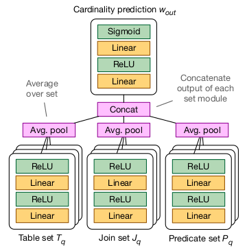

# MSCN基数估计

## 特征（feature）与标签（label）

​		每一个sql查询语句被分为三部分，分别为表、连接和谓词（查询条件），所以一个查询语句的特征向量也被分为三部分，即$T_{q}$、$J_{q}$和$P_{q}$，三者都是集合，因为一个查询语句可以查询多个表的连接，也可以有多个查询条件，所以一个特征向量就可以表示为$(T_{q},J_{q},P_{q})$，如下图所示。

​		对于每一个特征向量对应的标签，首先对所有查询语句的基数进行对数处理，使标签分布的更均匀，之后找出最大值和最小值，根据这两个值，将所有标签正则化到$[0,1]$的区间，此基数的处理过程是可逆的，当模型训练好后可以将模型输出的值转换为基数。因为当训练样本变化时，最大值和最小值也可能会变化，所以此时模型要重新训练。

## 模型结构

​		模型的理论来源是一个用于操作集合的神经网络模型[1]，深度集合模型基于此原理，一个作用于集合$S$的有排列不变性的函数$f(S)$可以被分解为$\rho[\sum_{x\in S}\phi(x)]$，其中$\rho$$和\phi$是经过选择的函数。

​		此模型使用MLP来代替$\rho$$和\phi$，模型结构如下图所示。

multi-set convolutional network的结构

​		因为特征向量有分为三部分，所以有三个MLP模型分别对应，最后将结果汇总后经过一个最终的MLP模型处理后得到结果，所有MLP模型的层数都是2层。

​	
